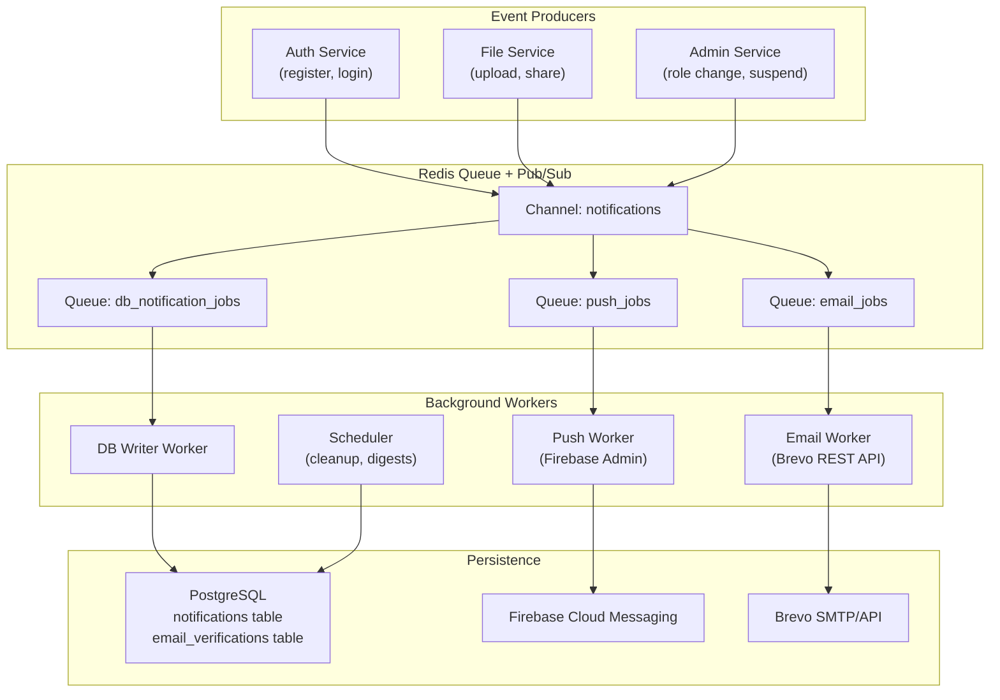
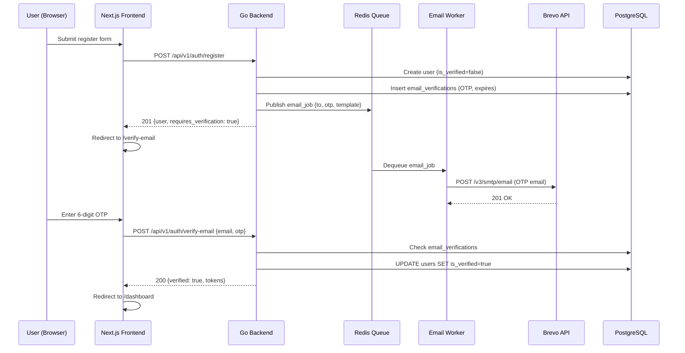

# PushPort Notification & Verification Engine Architecture

This document outlines the complete design, data structures, asynchronous processing queue, worker pools, and routing wiring for the PushPort notification engine.

---

## 1. System Design Overview



### Flow: Registration → OTP Verification



---

## 2. Database Migrations & Schemas

Create migration file: `backend/cmd/api/migrations/010_create_notifications.sql`

```sql
-- Email verification OTP tokens
CREATE TABLE IF NOT EXISTS email_verifications (
    id UUID PRIMARY KEY DEFAULT gen_random_uuid(),
    user_id UUID NOT NULL REFERENCES users(id) ON DELETE CASCADE,
    email VARCHAR(255) NOT NULL,
    otp_code VARCHAR(6) NOT NULL,
    purpose VARCHAR(50) NOT NULL DEFAULT 'registration',
    attempts INT NOT NULL DEFAULT 0,
    max_attempts INT NOT NULL DEFAULT 5,
    is_used BOOLEAN NOT NULL DEFAULT false,
    expires_at TIMESTAMPTZ NOT NULL,
    created_at TIMESTAMPTZ NOT NULL DEFAULT NOW()
);

CREATE INDEX IF NOT EXISTS idx_email_verifications_user ON email_verifications(user_id);
CREATE INDEX IF NOT EXISTS idx_email_verifications_email ON email_verifications(email);
CREATE INDEX IF NOT EXISTS idx_email_verifications_expires ON email_verifications(expires_at);

-- In-app notifications
CREATE TABLE IF NOT EXISTS notifications (
    id UUID PRIMARY KEY DEFAULT gen_random_uuid(),
    user_id UUID NOT NULL REFERENCES users(id) ON DELETE CASCADE,
    type VARCHAR(50) NOT NULL,
    title VARCHAR(255) NOT NULL,
    body TEXT,
    metadata JSONB DEFAULT '{}',
    channel VARCHAR(20) NOT NULL DEFAULT 'in_app',
    is_read BOOLEAN NOT NULL DEFAULT false,
    read_at TIMESTAMPTZ,
    created_at TIMESTAMPTZ NOT NULL DEFAULT NOW()
);

CREATE INDEX IF NOT EXISTS idx_notifications_user ON notifications(user_id);
CREATE INDEX IF NOT EXISTS idx_notifications_user_unread ON notifications(user_id, is_read) WHERE is_read = false;
CREATE INDEX IF NOT EXISTS idx_notifications_created ON notifications(created_at DESC);

-- Push notification device tokens (for Firebase)
CREATE TABLE IF NOT EXISTS push_tokens (
    id UUID PRIMARY KEY DEFAULT gen_random_uuid(),
    user_id UUID NOT NULL REFERENCES users(id) ON DELETE CASCADE,
    token TEXT NOT NULL UNIQUE,
    device_type VARCHAR(20) NOT NULL DEFAULT 'web',
    is_active BOOLEAN NOT NULL DEFAULT true,
    created_at TIMESTAMPTZ NOT NULL DEFAULT NOW(),
    updated_at TIMESTAMPTZ NOT NULL DEFAULT NOW()
);

CREATE INDEX IF NOT EXISTS idx_push_tokens_user ON push_tokens(user_id);

---- create above / drop below ----
DROP TABLE IF EXISTS push_tokens;
DROP TABLE IF EXISTS notifications;
DROP TABLE IF EXISTS email_verifications;
```

---

## 3. Go Structural Models

Create file: `backend/internal/model/notification.go`

```go
package model

import "time"

// EmailVerification stores OTP codes for email verification flows.
type EmailVerification struct {
	ID          string    `json:"id"`
	UserID      string    `json:"user_id"`
	Email       string    `json:"email"`
	OTPCode     string    `json:"-"` // Never expose in API responses
	Purpose     string    `json:"purpose"` // "registration", "password_reset"
	Attempts    int       `json:"attempts"`
	MaxAttempts int       `json:"max_attempts"`
	IsUsed      bool      `json:"is_used"`
	ExpiresAt   time.Time `json:"expires_at"`
	CreatedAt   time.Time `json:"created_at"`
}

// Notification represents an in-app notification stored in PostgreSQL.
type Notification struct {
	ID        string         `json:"id"`
	UserID    string         `json:"user_id"`
	Type      string         `json:"type"` // "file.shared", "account.verified", "system.alert"
	Title     string         `json:"title"`
	Body      string         `json:"body,omitempty"`
	Metadata  map[string]any `json:"metadata,omitempty"`
	Channel   string         `json:"channel"` // "in_app", "email", "push"
	IsRead    bool           `json:"is_read"`
	ReadAt    *time.Time     `json:"read_at,omitempty"`
	CreatedAt time.Time      `json:"created_at"`
}

// PushToken stores Firebase device tokens for push notifications.
type PushToken struct {
	ID         string    `json:"id"`
	UserID     string    `json:"user_id"`
	Token      string    `json:"token"`
	DeviceType string    `json:"device_type"` // "web", "android", "ios"
	IsActive   bool      `json:"is_active"`
	CreatedAt  time.Time `json:"created_at"`
	UpdatedAt  time.Time `json:"updated_at"`
}
```

---

## 4. Repositories Layer

### Email Verification Repository
Create file: `backend/internal/repository/email_verification_repository.go`

```go
package repository

import (
	"context"
	"errors"
	"fmt"
	"time"

	"github.com/jackc/pgx/v5"
	"github.com/jackc/pgx/v5/pgxpool"
	"github.com/archaditya/PushPort/internal/model"
)

var ErrVerificationNotFound = errors.New("verification record not found")

type EmailVerificationRepository struct {
	db *pgxpool.Pool
}

func NewEmailVerificationRepository(db *pgxpool.Pool) *EmailVerificationRepository {
	return &EmailVerificationRepository{db: db}
}

func (r *EmailVerificationRepository) Create(ctx context.Context, v *model.EmailVerification) error {
	query := `
		INSERT INTO email_verifications (user_id, email, otp_code, purpose, max_attempts, expires_at)
		VALUES ($1, $2, $3, $4, $5, $6)
		RETURNING id, created_at
	`
	return r.db.QueryRow(ctx, query,
		v.UserID, v.Email, v.OTPCode, v.Purpose, v.MaxAttempts, v.ExpiresAt,
	).Scan(&v.ID, &v.CreatedAt)
}

func (r *EmailVerificationRepository) FindLatestByEmail(ctx context.Context, email, purpose string) (*model.EmailVerification, error) {
	query := `
		SELECT id, user_id, email, otp_code, purpose, attempts, max_attempts, is_used, expires_at, created_at
		FROM email_verifications
		WHERE email = $1 AND purpose = $2 AND is_used = false
		ORDER BY created_at DESC
		LIMIT 1
	`
	var v model.EmailVerification
	err := r.db.QueryRow(ctx, query, email, purpose).Scan(
		&v.ID, &v.UserID, &v.Email, &v.OTPCode, &v.Purpose,
		&v.Attempts, &v.MaxAttempts, &v.IsUsed, &v.ExpiresAt, &v.CreatedAt,
	)
	if err != nil {
		if errors.Is(err, pgx.ErrNoRows) {
			return nil, ErrVerificationNotFound
		}
		return nil, fmt.Errorf("failed to find verification: %w", err)
	}
	return &v, nil
}

func (r *EmailVerificationRepository) IncrementAttempts(ctx context.Context, id string) error {
	_, err := r.db.Exec(ctx, `UPDATE email_verifications SET attempts = attempts + 1 WHERE id = $1`, id)
	return err
}

func (r *EmailVerificationRepository) MarkUsed(ctx context.Context, id string) error {
	_, err := r.db.Exec(ctx, `UPDATE email_verifications SET is_used = true WHERE id = $1`, id)
	return err
}

func (r *EmailVerificationRepository) InvalidateAllForUser(ctx context.Context, userID, purpose string) error {
	_, err := r.db.Exec(ctx,
		`UPDATE email_verifications SET is_used = true WHERE user_id = $1 AND purpose = $2 AND is_used = false`,
		userID, purpose,
	)
	return err
}

func (r *EmailVerificationRepository) CleanupExpired(ctx context.Context, before time.Time) (int64, error) {
	tag, err := r.db.Exec(ctx, `DELETE FROM email_verifications WHERE expires_at < $1`, before)
	if err != nil {
		return 0, err
	}
	return tag.RowsAffected(), nil
}
```

---

## 5. Queue & Async Workers

### Redis Queue Infrastructure
Create file: `backend/internal/notification/queue/redis.go`

```go
package queue

import (
	"context"
	"encoding/json"
	"fmt"
	"time"

	"github.com/redis/go-redis/v9"
	"github.com/archaditya/PushPort/internal/config"
	"github.com/archaditya/PushPort/internal/logger"
)

const (
	JobTypeEmail = "email"
	JobTypePush  = "push"
	JobTypeInApp = "in_app"

	QueueEmail = "PushPort:queue:email"
	QueuePush  = "PushPort:queue:push"
	QueueInApp = "PushPort:queue:in_app"

	ChannelNotifications = "PushPort:notifications"
)

type Job struct {
	ID        string         `json:"id"`
	Type      string         `json:"type"`
	UserID    string         `json:"user_id"`
	Payload   map[string]any `json:"payload"`
	CreatedAt time.Time      `json:"created_at"`
	Retries   int            `json:"retries"`
}

type RedisQueue struct {
	client *redis.Client
}

func NewRedisQueue(cfg config.RedisConfig) (*RedisQueue, error) {
	client := redis.NewClient(&redis.Options{
		Addr:     cfg.Addr(),
		Password: cfg.Password,
		DB:       cfg.DB,
	})

	ctx, cancel := context.WithTimeout(context.Background(), 5*time.Second)
	defer cancel()

	if err := client.Ping(ctx).Err(); err != nil {
		return nil, fmt.Errorf("failed to connect to Redis: %w", err)
	}

	logger.Log.Info().Str("addr", cfg.Addr()).Msg("Redis connected")
	return &RedisQueue{client: client}, nil
}

func (q *RedisQueue) Enqueue(ctx context.Context, job *Job) error {
	data, err := json.Marshal(job)
	if err != nil {
		return fmt.Errorf("failed to marshal job: %w", err)
	}

	queueName := QueueInApp
	switch job.Type {
	case JobTypeEmail:
		queueName = QueueEmail
	case JobTypePush:
		queueName = QueuePush
	}

	if err := q.client.LPush(ctx, queueName, data).Err(); err != nil {
		return fmt.Errorf("failed to enqueue job: %w", err)
	}

	q.client.Publish(ctx, ChannelNotifications, data)
	return nil
}

func (q *RedisQueue) Dequeue(ctx context.Context, queueName string, timeout time.Duration) (*Job, error) {
	result, err := q.client.BRPop(ctx, timeout, queueName).Result()
	if err != nil {
		if err == redis.Nil {
			return nil, nil
		}
		return nil, fmt.Errorf("failed to dequeue: %w", err)
	}

	var job Job
	if err := json.Unmarshal([]byte(result[1]), &job); err != nil {
		return nil, fmt.Errorf("failed to unmarshal job: %w", err)
	}

	return &job, nil
}
```

### Background Worker Pool
Create file: `backend/internal/notification/worker/workers.go`

```go
package worker

import (
	"context"
	"time"

	firebase "firebase.google.com/go/v4"
	"firebase.google.com/go/v4/messaging"
	"google.golang.org/api/option"

	"github.com/archaditya/PushPort/internal/config"
	"github.com/archaditya/PushPort/internal/logger"
	"github.com/archaditya/PushPort/internal/model"
	"github.com/archaditya/PushPort/internal/notification/email"
	"github.com/archaditya/PushPort/internal/notification/queue"
	"github.com/archaditya/PushPort/internal/repository"
)

type WorkerPool struct {
	queue         *queue.RedisQueue
	emailClient   *email.BrevoClient
	fcmClient     *messaging.Client
	userRepo      *repository.UserRepository
	notifRepo     *repository.NotificationRepository
	pushTokenRepo *repository.PushTokenRepository
	ctx           context.Context
	cancel        context.CancelFunc
}

func NewWorkerPool(
	cfg *config.Config,
	q *queue.RedisQueue,
	emailClient *email.BrevoClient,
	userRepo *repository.UserRepository,
	notifRepo *repository.NotificationRepository,
	pushTokenRepo *repository.PushTokenRepository,
) (*WorkerPool, error) {
	ctx, cancel := context.WithCancel(context.Background())

	var fcmClient *messaging.Client
	if cfg.Notification.Firebase.CredentialsFile != "" {
		opt := option.WithCredentialsFile(cfg.Notification.Firebase.CredentialsFile)
		app, err := firebase.NewApp(ctx, nil, opt)
		if err == nil {
			messagingClient, err := app.Messaging(ctx)
			if err == nil {
				fcmClient = messagingClient
			}
		}
	}

	return &WorkerPool{
		queue:         q,
		emailClient:   emailClient,
		fcmClient:     fcmClient,
		userRepo:      userRepo,
		notifRepo:     notifRepo,
		pushTokenRepo: pushTokenRepo,
		ctx:           ctx,
		cancel:        cancel,
	}, nil
}

func (wp *WorkerPool) Start() {
	for i := 1; i <= 2; i++ {
		go wp.runEmailWorker(i)
		go wp.runPushWorker(i)
		go wp.runDBWriterWorker(i)
	}
}

func (wp *WorkerPool) runEmailWorker(id int) {
	for {
		select {
		case <-wp.ctx.Done():
			return
		default:
			job, err := wp.queue.Dequeue(wp.ctx, queue.QueueEmail, 5*time.Second)
			if err != nil || job == nil {
				continue
			}

			toEmail, _ := job.Payload["to_email"].(string)
			toName, _ := job.Payload["to_name"].(string)
			otp, _ := job.Payload["otp"].(string)
			purpose, _ := job.Payload["purpose"].(string)

			var sendErr error
			if purpose == "registration" {
				sendErr = wp.emailClient.SendOTP(wp.ctx, toEmail, toName, otp)
			} else if purpose == "password_reset" {
				sendErr = wp.emailClient.SendPasswordReset(wp.ctx, toEmail, toName, otp)
			}

			if sendErr != nil {
				wp.retryJob(job)
			}
		}
	}
}

func (wp *WorkerPool) retryJob(job *queue.Job) {
	if job.Retries >= 3 {
		return
	}
	job.Retries++
	time.AfterFunc(5*time.Second, func() {
		wp.queue.Enqueue(context.Background(), job)
	})
}

// ... remaining push and db writer workers ...
```

---

## 6. Schedulers & Orchestration

Create file: `backend/internal/notification/scheduler/scheduler.go`

```go
package scheduler

import (
	"context"
	"time"

	"github.com/archaditya/PushPort/internal/logger"
	"github.com/archaditya/PushPort/internal/repository"
)

type Scheduler struct {
	verifyRepo *repository.EmailVerificationRepository
	notifRepo  *repository.NotificationRepository
	ticker     *time.Ticker
	ctx        context.Context
	cancel     context.CancelFunc
}

func NewScheduler(
	verifyRepo *repository.EmailVerificationRepository,
	notifRepo *repository.NotificationRepository,
) *Scheduler {
	ctx, cancel := context.WithCancel(context.Background())
	return &Scheduler{
		verifyRepo: verifyRepo,
		notifRepo:  notifRepo,
		ctx:        ctx,
		cancel:     cancel,
	}
}

func (s *Scheduler) Start() {
	s.ticker = time.NewTicker(6 * time.Hour)
	go func() {
		s.cleanup()
		for {
			select {
			case <-s.ctx.Done():
				return
			case <-s.ticker.C:
				s.cleanup()
			}
		}
	}()
}

func (s *Scheduler) cleanup() {
	ctx, cancel := context.WithTimeout(context.Background(), 1*time.Minute)
	defer cancel()

	// Clean verification entries expired > 2 hours
	otpBefore := time.Now().Add(-2 * time.Hour)
	s.verifyRepo.CleanupExpired(ctx, otpBefore)

	// Clean in-app notifications > 30 days
	notifBefore := time.Now().Add(-30 * 24 * time.Hour)
	s.notifRepo.CleanupOld(ctx, notifBefore)
}
```

---

## 7. Router Wiring

Update routing file: `backend/internal/server/routes.go`

```go
// A. Initialize Redis Queue
redisQueue, err := queue.NewRedisQueue(s.config.Redis)
if err != nil {
	logger.Log.Error().Err(err).Msg("Failed to initialize Redis Queue")
}

// B. Repositories setup
verifyRepo := repository.NewEmailVerificationRepository(s.db)
notifRepo := repository.NewNotificationRepository(s.db)
pushTokenRepo := repository.NewPushTokenRepository(s.db)

// C. Services Setup
emailClient := email.NewBrevoClient(s.config.Notification.Brevo)
notifService := service.NewNotificationService(redisQueue, notifRepo, verifyRepo, pushTokenRepo, userRepo)

// D. Background Worker Loops
if redisQueue != nil {
	wp, _ := worker.NewWorkerPool(s.config, redisQueue, emailClient, userRepo, notifRepo, pushTokenRepo)
	wp.Start()
}

// E. Periodic Database Cleanups
bgScheduler := scheduler.NewScheduler(verifyRepo, notifRepo)
bgScheduler.Start()
```


---

### Setup and Running Commands

To boot up the application correctly:

#### 1. Start Services
Make sure your PostgreSQL database and Redis server are running:
```powershell
# Run Redis (required for queue operations)
redis-server
```

#### 2. Start Backend API
```powershell
cd b:\Personal-Projects\PushPort\backend
go run cmd/api/main.go
```
*(Always run `cmd/api/main.go` instead of `cmd/server/main.go` to avoid path specification errors).*

#### 3. Start Frontend Dev Client
```powershell
cd b:\Personal-Projects\PushPort\frontend
npm run dev
```