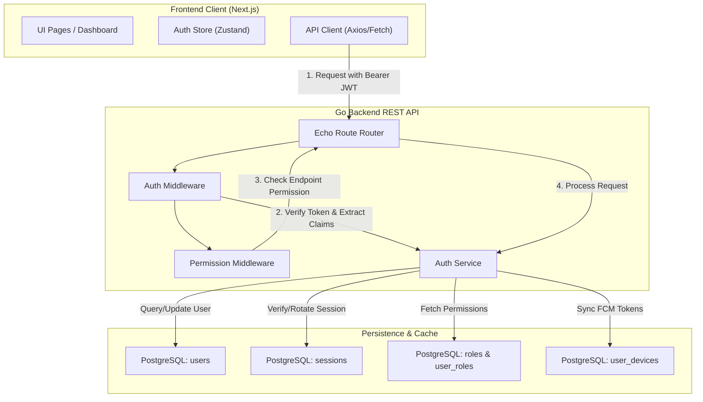
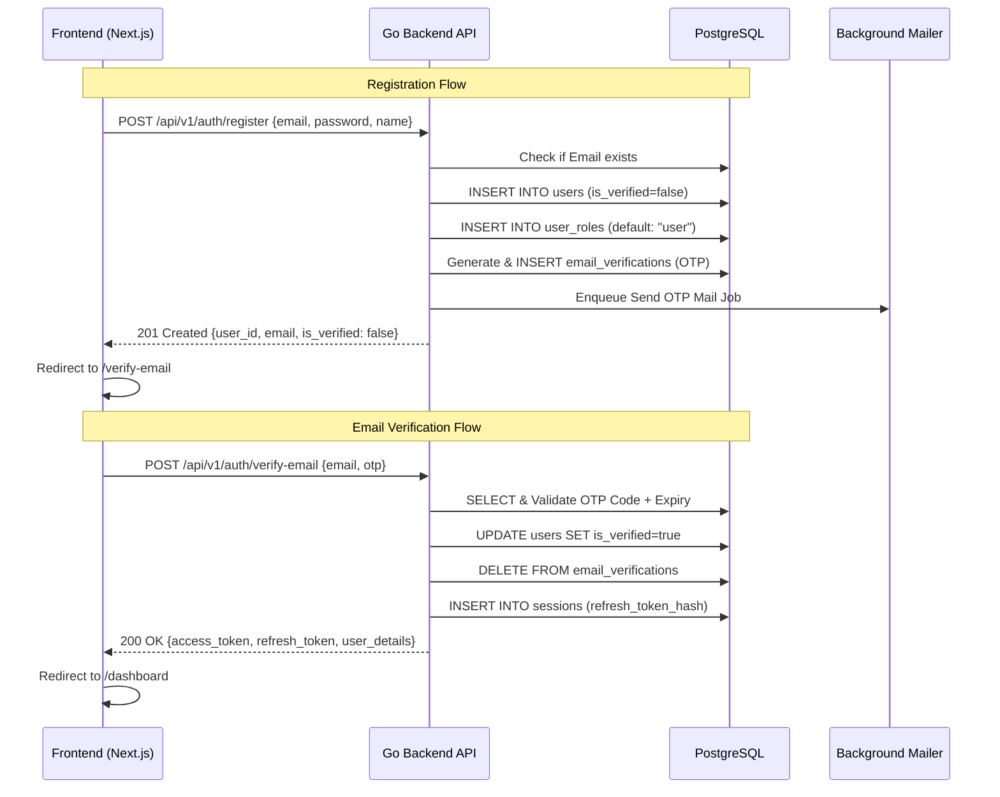
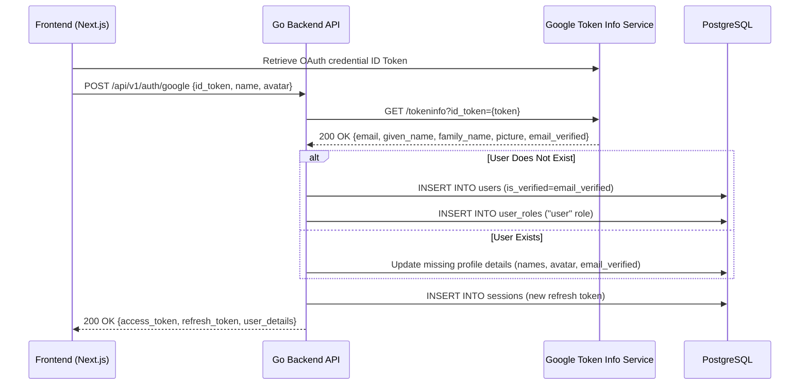
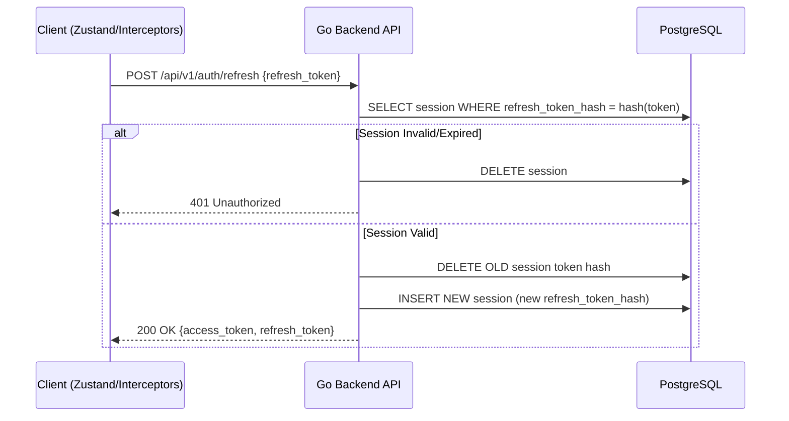
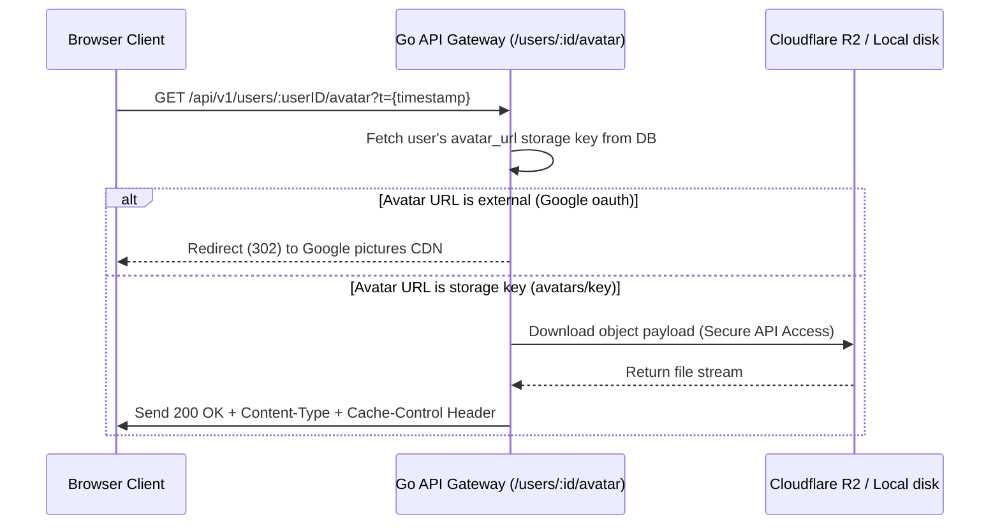

# PushPort User Authentication & Session Engine Architecture

This document describes the design, database schemas, sequence flows, Role-Based Access Control (RBAC) model, and avatar management systems powering the User Authentication & Session Engine of PushPort.

---

## 1. System Design Overview

PushPort implements a stateless, token-based authentication mechanism using JSON Web Tokens (JWT) for access validation and database-backed session tracking for refresh tokens. 



---

## 2. Sequence Flows

### Flow A: Credentials Registration, Login & Email Verification



### Flow B: Google OAuth 2.0 Integration & Auto-Sync

Google OAuth verifies authentications using ID Tokens directly on the backend. It automatically registers new users with a secure temporary password, assigns roles, and validates email verification.



### Flow C: JWT Refresh Token Rotation (RTR)

PushPort implements Refresh Token Rotation. When a client requests a new access token, the current refresh token is revoked and replaced with a new one.



---

## 3. Database Schema

### Table: `users`
Stores primary profile data. Passwords are encrypted using bcrypt (cost 14) and are nullable to support pure OAuth users.
```sql
CREATE TABLE users (
    id UUID PRIMARY KEY DEFAULT gen_random_uuid(),
    email VARCHAR(255) UNIQUE NOT NULL,
    password VARCHAR(255), -- Nullable for OAuth-only users
    first_name VARCHAR(100),
    last_name VARCHAR(100),
    avatar_url TEXT, -- Stores Google CDN URLs or internal storage keys
    is_verified BOOLEAN DEFAULT FALSE NOT NULL,
    status VARCHAR(50) DEFAULT 'active',
    created_at TIMESTAMP WITH TIME ZONE DEFAULT CURRENT_TIMESTAMP NOT NULL,
    updated_at TIMESTAMP WITH TIME ZONE DEFAULT CURRENT_TIMESTAMP NOT NULL,
    deleted_at TIMESTAMP WITH TIME ZONE -- Soft delete support
);
```

### Table: `sessions`
Used for tracking and rotating active device refresh sessions.
```sql
CREATE TABLE sessions (
    id UUID PRIMARY KEY DEFAULT gen_random_uuid(),
    user_id UUID NOT NULL REFERENCES users(id) ON DELETE CASCADE,
    refresh_token_hash VARCHAR(64) UNIQUE NOT NULL, -- SHA-256 hash of refresh token
    user_agent TEXT,
    ip_address VARCHAR(45),
    expires_at TIMESTAMP WITH TIME ZONE NOT NULL,
    created_at TIMESTAMP WITH TIME ZONE DEFAULT CURRENT_TIMESTAMP NOT NULL,
    last_used_at TIMESTAMP WITH TIME ZONE DEFAULT CURRENT_TIMESTAMP NOT NULL
);
```

### Table: `roles` & `user_roles`
Implements a database-backed Role-Based Access Control (RBAC) model.
```sql
CREATE TABLE roles (
    id UUID PRIMARY KEY DEFAULT gen_random_uuid(),
    name VARCHAR(50) UNIQUE NOT NULL, -- e.g., 'user', 'admin', 'super_admin'
    description TEXT,
    permissions JSONB NOT NULL DEFAULT '{}'::jsonb, -- Map of permission keys to booleans
    is_system_role BOOLEAN DEFAULT FALSE NOT NULL,
    created_at TIMESTAMP WITH TIME ZONE DEFAULT CURRENT_TIMESTAMP NOT NULL,
    updated_at TIMESTAMP WITH TIME ZONE DEFAULT CURRENT_TIMESTAMP NOT NULL
);

CREATE TABLE user_roles (
    user_id UUID REFERENCES users(id) ON DELETE CASCADE,
    role_id UUID REFERENCES roles(id) ON DELETE CASCADE,
    assigned_at TIMESTAMP WITH TIME ZONE DEFAULT CURRENT_TIMESTAMP NOT NULL,
    assigned_by UUID REFERENCES users(id) ON DELETE SET NULL,
    PRIMARY KEY (user_id, role_id)
);
```

---

## 4. JWT Claims Architecture

Access tokens are signed using HMAC-SHA256 and store authorization attributes to support stateless API validation without database queries on every request.

### Claim Structure Example
```json
{
  "sub": "038487c6-6956-49e3-8ed9-02d209ff17b1",
  "role": "user",
  "permissions": {
    "file.read": true,
    "file.write": true,
    "file.delete": true,
    "share.create": true
  },
  "iat": 1783280779,
  "exp": 1783281679
}
```

---

## 5. Avatar Management & Secure Proxying

Cloudflare R2/S3 buckets containing private assets like user data cannot serve files directly over standard public links. In addition, the maximum expiration window for AWS Signature Version 4 presigned URLs is strictly limited to 7 days, meaning stored static links eventually expire and break client-side image tags.

PushPort handles this by keeping R2 buckets private and dynamic via a backend streaming proxy:



### Key Technical Aspects
1. **Dynamic Streaming**: The proxy maps the request to the storage provider `store.Download()`, supporting both Cloudflare R2 and Local directory providers.
2. **Standard Cache headers**: Responds with `Cache-Control: public, max-age=86400` so client browsers cache user avatars locally for up to 1 day.
3. **Cache-Busting on Update**: The frontend appends a query parameter matching the user's last profile update timestamp (`?t=timestamp`). When the avatar is changed, the URL changes, forcing the browser to fetch the updated image immediately.
```
```

***

### Summary of Completed Improvements
1. **R2 Signature Fix**: Replaced the expiring 1-year presigned URLs in the DB with the dynamic backend proxy endpoint `/api/v1/users/:id/avatar`.
2. **Dynamic Serving**: Standardized content-type detection and configured a `Cache-Control` header for fast inline image rendering.
3. **Cache-Busting Integration**: Modified the frontend Zustand auth store to map relative avatar paths to the absolute API gateway with automated cache-busting timestamping.