# PushPort Multipart Upload Architecture Walkthrough

PushPort uploads large files securely, efficiently, and with real-time feedback using a three-phase multipart upload pattern.

---

## 1. The Three-Phase Protocol

```mermaid
sequenceDiagram
    autonumber
    participant Browser as Client Browser
    participant API as Go API Backend
    participant R2 as Cloudflare R2 (S3)

    Note over Browser, API: Phase 1: Initialize Handshake
    Browser->>API: POST /api/v1/files/multipart-session (file metadata)
    API-->>Browser: 200 OK (file_id, upload_id, array of pre-signed URLs)

    Note over Browser, R2: Phase 2: Parallel Chunk Uploads
    rect rgb(10, 30, 60)
        par Chunk 1 to N-1
            Browser->>R2: PUT /part_url_1 (5MB slice)
            R2-->>Browser: 200 OK (ETag header)
        and Remainder Chunk N
            Browser->>R2: PUT /part_url_N (remainder slice)
            R2-->>Browser: 200 OK (ETag header)
        end
    end

    Note over Browser, API: Phase 3: Assembly & Completion
    Browser->>API: POST /api/v1/files/:id/complete-multipart (upload_id & sorted ETags)
    API->>R2: S3 CompleteMultipartUpload request
    R2-->>API: Finished Object ACK
    API-->>Browser: 200 OK (Archived Confirmation)
```



### Phase 1: The Handshake
1. Before uploading, the frontend determines if the file is larger than the chunk size limit (`5MB`).
2. If it is, the frontend sends a `POST` request to `/api/v1/files/multipart-session` with the filename, total file size, and the calculated number of parts.
3. The Go backend contacts Cloudflare R2 to initiate a multipart upload session. It returns a **Session Upload ID** and an array of **pre-signed PUT URLs**—one URL for each part of the file.

### Phase 2: Concurrent Chunk Uploads
1. The frontend slices the file locally using JavaScript's `.slice()` method into `5MB` chunks:
   ```typescript
   const start = (part.part_number - 1) * CHUNK_SIZE;
   const end = Math.min(start + CHUNK_SIZE, file.size);
   const chunk = file.slice(start, end);
   ```
2. It dispatches all part uploads **concurrently** using `Promise.all()`.
3. The browser uploads each chunk binary directly to Cloudflare R2 via its pre-signed URL.
4. When R2 receives a chunk successfully, it returns a unique identifier called an `ETag` in the response headers.

### Phase 3: Finalizing Assembly
1. Once all parallel upload promises resolve, the frontend collects the list of all part numbers and their corresponding `ETag` values.
2. It calls the `POST /api/v1/files/:id/complete-multipart` endpoint, sending the `upload_id` and the sorted list of `ETags`.
3. The Go backend makes a final request to R2 to stitch all chunks together into a single permanent object, validating the integrity of the file.

---

## 2. Real-Time Stats Management

Here is exactly how the client calculates progress, speed, and ETA:

### Chunk Status Matrix
We initialize an array in our state manager matching the parts of the file. As each chunk starts uploading, we update its status:
* **Pending**: The chunk is waiting to be sent.
* **Streaming**: The chunk is actively sending bytes over the network.
* **Complete**: The chunk has been fully uploaded and its `ETag` was returned.

### Progress & Speed Tracking
We track the overall progress dynamically:
```typescript
const durationSec = (Date.now() - startTime) / 1000 || 1;
const speed = chunkSize / durationSec;

currentTransferredBytes += chunkSize;
```

1. **Why the speed oscillates or estimates quickly**: Since the uploads happen concurrently, the smallest remainder chunk (the last one) completes first. This immediately sets the starting speed and shows the progress bar incrementing by the size of that first tiny chunk.
2. **Rolling Average Speed**: Rather than calculating the speed of a single second, we collect speed samples of completed parts into `speedHistory` and calculate the average:
   ```typescript
   const avgSpeed = speedHistory.reduce((acc, curr) => acc + curr.bytesPerSecond, 0) / speedHistory.length;
   ```
3. **ETA Calculation**:
   $$\text{ETA (seconds)} = \frac{\text{File Size} - \text{Bytes Transferred}}{\text{Average Speed}}$$

---

## 3. Persistent LocalStorage Sync

To ensure that completed and active uploads do not disappear when you refresh the page:
1. We use a Zustand state hook (`useTransferStore`) that writes all mutations (`addTransfer`, `updateTransfer`, `removeTransfer`) directly into the browser's `localStorage`.
2. When the Transfers page loads, it triggers `loadFromLocalStorage()` to pull all historical transfer sessions and their logs.
3. When a transfer completes, we store a timestamp for `completedAt`, allowing us to compute the exact duration of the upload:
   $$\text{Duration} = \text{completedAt} - \text{startedAt}$$
   This displays the premium `Took: 57s` badge on completed cards.
