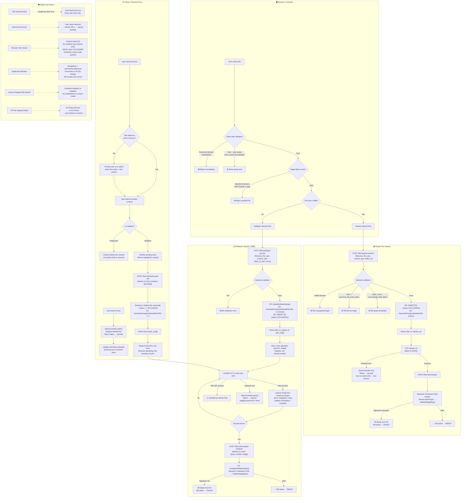
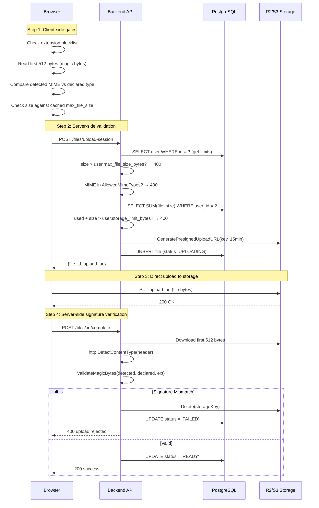
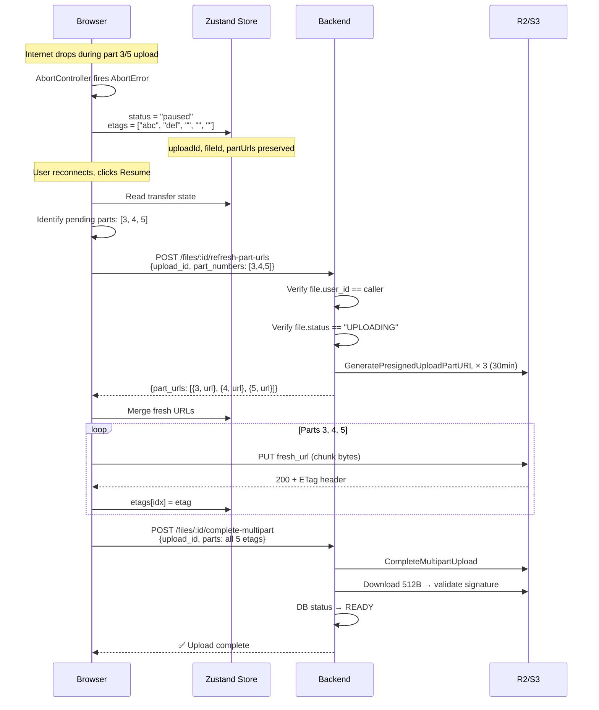

# ByteVault Upload Flow — Production Architecture

## Complete Upload Flow with Edge Cases

```mermaid
flowchart TD
    subgraph Browser["🖥️ Browser / Frontend"]
        A[User selects file] --> B{Client-side Validation}
        B -->|"Extension blocked<br/>(exe/bat/sh)"| B_REJECT[❌ Reject immediately]
        B -->|"Size > user quota<br/>(from cached QuotaStats)"| B_QUOTA[❌ Show quota error]
        B -->|Pass| C{Magic Bytes Check}
        C -->|"Spoofed extension<br/>(PNG header ≠ .jpg)"| C_REJECT[❌ Reject spoofed file]
        C -->|Valid| D{File Size ≤ 5MB?}

        D -->|Yes| SIMPLE[Simple Upload Flow]
        D -->|No| MULTI[Multipart Upload Flow]
    end

    subgraph SimpleFlow["📤 Single-Part Upload"]
        SIMPLE --> S1["POST /files/upload-session<br/>{filename, file_size, content_type, folder_id}"]
        S1 --> S2{Backend validates}
        S2 -->|"MIME blocked"| S2_ERR[❌ 400 unsupported type]
        S2 -->|"size > user.max_file_size_bytes"| S2_SIZE[❌ 400 file too large]
        S2 -->|"used + size > user.storage_limit_bytes"| S2_QUOTA[❌ 400 quota exceeded]
        S2 -->|Pass| S3["DB: INSERT file (status=UPLOADING)<br/>R2: GeneratePresignedUploadURL (15min)"]
        S3 --> S4["Return {file_id, upload_url}"]
        S4 --> S5["PUT upload_url<br/>(direct to R2/S3)"]
        S5 -->|"Network loss"| S5_NET["AbortController fires<br/>Status → paused<br/>User re-selects file → new session"]
        S5 -->|Success| S6["POST /files/:id/complete"]
        S6 --> S7["Backend: Download 512B header<br/>DetectContentType → ValidateMagicBytes"]
        S7 -->|"Signature mismatch"| S7_ERR["❌ Delete from R2<br/>DB status → FAILED"]
        S7 -->|Valid| S8["✅ DB status → READY"]
    end

    subgraph MultiFlow["📦 Multipart Upload (>5MB)"]
        MULTI --> M1["POST /files/multipart-session<br/>{filename, file_size, content_type,<br/>folder_id, part_count}"]
        M1 --> M2{Backend validates}
        M2 -->|Fail| M2_ERR[❌ 400 validation error]
        M2 -->|Pass| M3["R2: InitiateMultipartUpload<br/>R2: GeneratePresignedUploadPartURL × N (30min)<br/>DB: INSERT file (status=UPLOADING)"]
        M3 --> M4["Return {file_id, upload_id, part_urls[]}"]
        M4 --> M5["Store: save uploadId, partUrls, etags[]<br/>Registry: set AbortController"]
        M5 --> M6["Parallel PUT to each part URL"]

        M6 -->|"Part success"| M7["Capture ETag from response header<br/>Store: etags[idx] = etag<br/>Update chunks[idx] = complete"]
        M6 -->|"403 URL expired"| M6_EXP["⚠️ Handled by refresh flow"]
        M6 -->|"Network loss"| M6_NET["AbortController.abort()<br/>Status → paused<br/>etags[] preserved in store"]

        M7 --> M8{All parts done?}
        M8 -->|No| M6
        M8 -->|Yes| M9["POST /files/:id/complete-multipart<br/>{upload_id, parts: [{part_number, etag}]}"]
        M9 --> M10["R2: CompleteMultipartUpload<br/>Backend: Download 512B → ValidateMagicBytes"]
        M10 -->|"Signature fail"| M10_ERR["❌ Delete from R2<br/>DB status → FAILED"]
        M10 -->|Valid| M11["✅ DB status → READY"]
    end

    subgraph PauseResume["⏸️ Pause / Resume Flow"]
        P1["User clicks Pause"] --> P2["AbortController.abort()<br/>Registry.delete(txId)<br/>Store: status → paused"]
        P2 --> P3["etags[], partUrls[], uploadId<br/>all preserved in Zustand store"]

        P4["User clicks Resume"] --> P5{File reference<br/>still in memory?}
        P5 -->|No| P6["Prompt user to re-select<br/>same file (name + size match)"]
        P5 -->|Yes| P7["New AbortController created"]
        P6 --> P7

        P7 --> P8{Is multipart?}
        P8 -->|"Single-part"| P9["Create entirely new session<br/>(no partial state to resume)"]
        P8 -->|"Multipart"| P10["Identify pending parts<br/>(where etags[idx] is empty)"]

        P10 --> P11["POST /files/:id/refresh-part-urls<br/>{upload_id, part_numbers: [pending]}"]
        P11 --> P12["Backend: Validate file ownership<br/>+ status == UPLOADING<br/>R2: GeneratePresignedUploadPartURL × N"]
        P12 --> P13["Return fresh {part_urls[]}"]
        P13 --> P14["Merge fresh URLs into store<br/>Resume uploading only pending chunks"]
        P14 --> M6
    end

    subgraph EdgeCases["🛡️ Edge Case Matrix"]
        E1["URL Expired (403)"] -.->|"Caught by fetch error"| E1A["Call refresh-part-urls<br/>Retry with fresh URL"]
        E2["Internet Reconnect"] -.-> E2A["User clicks Resume<br/>→ refresh URLs → upload pending"]
        E3["Browser Tab Closed"] -.-> E3A["Zustand state lost<br/>R2 multipart auto-expires (24h)<br/>DB file stays UPLOADING<br/>Scheduler cleans stale uploads"]
        E4["Duplicate Filename"] -.-> E4A["storageKey = user/ID/docs/filename<br/>Overwrites in R2 (by design)<br/>DB creates new record"]
        E5["Quota Changed Mid-Upload"] -.-> E5A["complete-multipart re-validates<br/>via validateFile on session create"]
        E6["R2 Part Upload Partial"] -.-> E6A["No ETag returned<br/>→ error thrown<br/>→ part retried on resume"]
    end
```

## Validation Pipeline

```mermaid
sequenceDiagram
    participant B as Browser
    participant API as Backend API
    participant DB as PostgreSQL
    participant R2 as R2/S3 Storage

    Note over B: Step 1: Client-side gates
    B->>B: Check extension blocklist
    B->>B: Read first 512 bytes (magic bytes)
    B->>B: Compare detected MIME vs declared type
    B->>B: Check size against cached max_file_size

    Note over B,API: Step 2: Server-side validation
    B->>API: POST /files/upload-session
    API->>DB: SELECT user WHERE id = ? (get limits)
    API->>API: size > user.max_file_size_bytes? → 400
    API->>API: MIME in AllowedMimeTypes? → 400
    API->>DB: SELECT SUM(file_size) WHERE user_id = ?
    API->>API: used + size > user.storage_limit_bytes? → 400
    API->>R2: GeneratePresignedUploadURL(key, 15min)
    API->>DB: INSERT file (status=UPLOADING)
    API-->>B: {file_id, upload_url}

    Note over B,R2: Step 3: Direct upload to storage
    B->>R2: PUT upload_url (file bytes)
    R2-->>B: 200 OK

    Note over B,API: Step 4: Server-side signature verification
    B->>API: POST /files/:id/complete
    API->>R2: Download first 512 bytes
    API->>API: http.DetectContentType(header)
    API->>API: ValidateMagicBytes(detected, declared, ext)
    alt Signature Mismatch
        API->>R2: Delete(storageKey)
        API->>DB: UPDATE status = 'FAILED'
        API-->>B: 400 upload rejected
    else Valid
        API->>DB: UPDATE status = 'READY'
        API-->>B: 200 success
    end
```

## Resume After Disconnection

```mermaid
sequenceDiagram
    participant B as Browser
    participant Store as Zustand Store
    participant API as Backend
    participant R2 as R2/S3

    Note over B: Internet drops during part 3/5 upload
    B->>B: AbortController fires AbortError
    B->>Store: status = "paused"<br/>etags = ["abc", "def", "", "", ""]
    Note over Store: uploadId, fileId, partUrls preserved

    Note over B: User reconnects, clicks Resume
    B->>Store: Read transfer state
    B->>B: Identify pending parts: [3, 4, 5]

    B->>API: POST /files/:id/refresh-part-urls<br/>{upload_id, part_numbers: [3,4,5]}
    API->>API: Verify file.user_id == caller
    API->>API: Verify file.status == "UPLOADING"
    API->>R2: GeneratePresignedUploadPartURL × 3 (30min)
    API-->>B: {part_urls: [{3, url}, {4, url}, {5, url}]}

    B->>Store: Merge fresh URLs
    loop Parts 3, 4, 5
        B->>R2: PUT fresh_url (chunk bytes)
        R2-->>B: 200 + ETag header
        B->>Store: etags[idx] = etag
    end

    B->>API: POST /files/:id/complete-multipart<br/>{upload_id, parts: all 5 etags}
    API->>R2: CompleteMultipartUpload
    API->>R2: Download 512B → validate signature
    API->>API: DB status → READY
    API-->>B: ✅ Upload complete
```

## Admin Quota Management Flow

```mermaid
flowchart LR
    A[Admin Dashboard] --> B["Edit User Modal"]
    B --> C["Set Storage Quota (GB)<br/>Set Max File Size (MB)"]
    C --> D["PUT /admin/users/:id<br/>{storage_limit_bytes, max_file_size_bytes}"]
    D --> E["UserRepo.UpdateDetails()<br/>COALESCE preserves existing values"]
    E --> F["DB: users table updated"]
    F --> G["Next upload by user<br/>validateFile() reads fresh limits"]

    style A fill:#1a1a2e
    style F fill:#16213e
    style G fill:#0f3460
```
